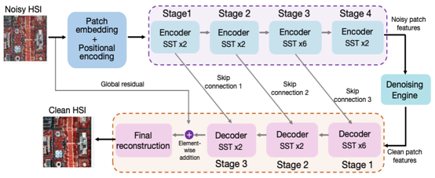

# About Me:
- Enthusiastic about machine learning and deep learning.
- Strong interest in data-driven mathematical modeling, including governing-equation discovery from time-series data.
- Focused on the intersection of computer vision and scientific machine learning, with emphasis on robustness and interpretability.

## Socials:
  

# Tech Stack:
         

# Currently Working On
   - Adaptive Spatial-Spectral Denoising Of Hyperspectral Images. [Link](https://github.com/AL-FHA/data_driven_ODE_discovery/) </li>
   - Learning Dynamical System Equations from Observed Temporal Measurements. [Link](https://github.com/AL-FHA/data_driven_ODE_discovery/) </li>

# 🎯 Project Showcase

<table>
<tr>

<td width="33%" align="center">

Adaptive Spatial–Spectral HSI Denoising

Deep learning–based hyperspectral image denoising with
spatial–spectral attention and progressive refinement pipeline.

<a href="https://github.com/AL-FHA/HSI_denoising_pipeline">
<strong>🔗 View Repository</strong>
</a>

</td>

<td width="33%" align="center">

Data-Driven ODE Discovery

Learning governing dynamical system equations from noisy time-series
data using sparse regression & scientific machine learning.

<a href="https://github.com/AL-FHA/data_driven_ODE_discovery">
<strong>🔗 View Repository</strong>
</a>

</td>

<td width="33%" align="center">

Transformer Models for High-Dimensional Data

Representation learning & robustness evaluation across imaging
and temporal domains with interpretability focus.

<a href="#">
<strong>🔗 View Repository</strong>
</a>

</td>

</tr>
</table>

