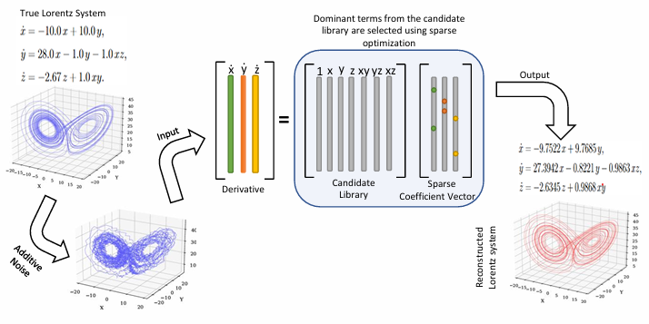
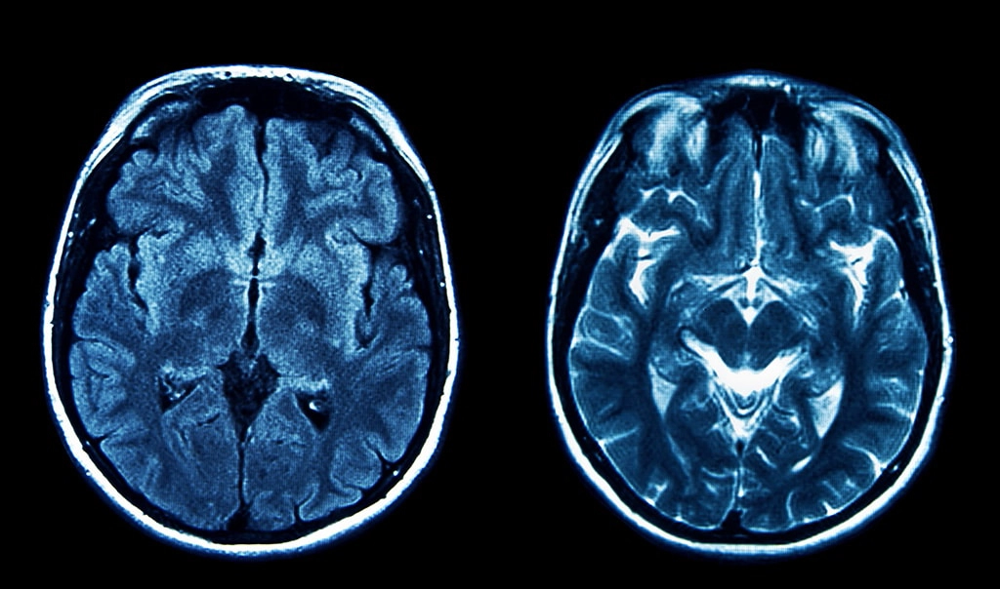
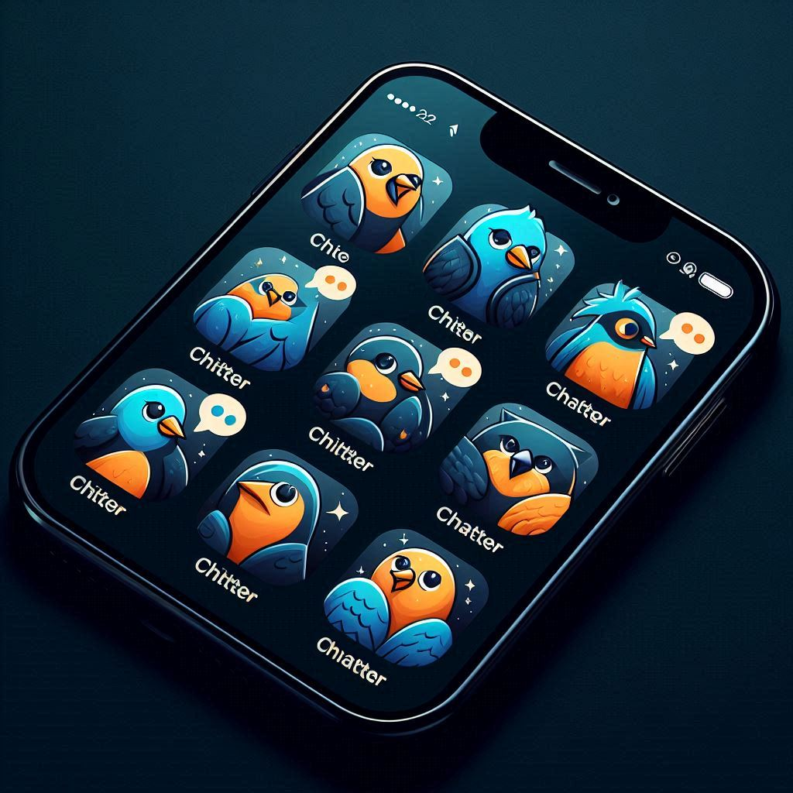

# About Me:
- Enthusiastic about machine learning and deep learning.
- Strong interest in data-driven mathematical modeling, including governing-equation discovery from time-series data.
- Focused on the intersection of computer vision and scientific machine learning, with emphasis on robustness and interpretability.

## Socials:
  

# Tech Stack:

### ML & Data Science

---

### Programming Languages

---

### Web & Hardware / Others

# Currently Working On
   - Adaptive Spatial-Spectral Denoising Of Hyperspectral Images. [Repo](https://github.com/AL-FHA/data_driven_ODE_discovery/) </li>
   - Learning Dynamical System Equations from Observed Temporal Measurements. [Repo](https://github.com/AL-FHA/data_driven_ODE_discovery/) </li>

# Project Showcase

<table>
<tr>

<td width="33%" align="center">

Adaptive Spatial-Spectral Denoising Of Hyperspectral Images

Deep learning–based hyperspectral image denoising with
spatial–spectral attention and progressive refinement pipeline.

<a href="https://github.com/muhtasim-ishmum-khan/HSI_denoising">
<strong>🔗 View Repository</strong>
</a>

</td>

<td width="33%" align="center">

Learning Dynamical System Equations from Observed Temporal Measurements

Learning governing dynamical system equations from noisy time-series
data using sparse regression.

<a href="https://github.com/AL-FHA/data-driven-ode-discovery">
<strong>🔗 View Repository</strong>
</a>

</tr>

</tr>

</td>

<td width="33%" align="center">

MRI-based Brain Tumor Detection using Covolutional Neural Networks

MRI-based brain tumor detection system leveraging convolutional neural networks (CNNs) 
   to distinguish tumor regions from MRI scans.

<a href="https://github.com/muhtasim-ishmum-khan/DL_project_CSE465">
<strong>🔗 View Repository</strong>
</a>

</td>

<td width="33%" align="center">

Chitter-Chatter

A chatting applicaton developed using flutter.

<a href="https://github.com/whowasif/ChitterChatter-299-project">
<strong>🔗 View Repository</strong>
</a>

</td>
</tr>
</table>

